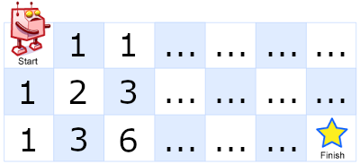

A robot is located at the top-left corner of a *m* x *n* grid (marked 'Start' in the diagram below).

The robot can only move either down or right at any point in time.  The robot is trying to reach the bottom-right corner of the grid (marked 'Finish' in the diagram below).

How many possible unique paths are there?


Above is a 7 x 3 grid. How many possible unique paths are there?


**Example 1:**

```
Input: m = 3, n = 2
Output: 3
Explanation:
From the top-left corner, there are a total of 3 ways to reach the bottom-right corner:
1. Right -> Right -> Down
2. Right -> Down -> Right
3. Down -> Right -> Right
```

**Example 2:**

```
Input: m = 7, n = 3
Output: 28
```


**Constraints:**

- `1 <= m, n <= 100`
- It's guaranteed that the answer will be less than or equal to `2 * 10 ^ 9`.


### Solution 1 - Dynamic Programming

```python
class Solution:
    def uniquePaths(self, m: int, n: int) -> int:
        grid = [[0] * m for i in range(n)]

        grid[0][0] = 1

        for r in range(n):
            for c in range(m):
                if r > 0:
                    grid[r][c] += grid[r - 1][c]
                if c > 0:
                    grid[r][c] += grid[r][c - 1]

        return grid[n - 1][m - 1]
```

This solution is actually very simple in concept. We loop through each square of the grid, we calculate the score of our current square by adding the scores of the square directly above and directly to the left of it.



The grid above is partially filled out. As you can see, the score of each square comes from the scores of the squares above and to the left of it. If you finish filling out the grid, the "finish" square will end up with the correct score of 28.


### Solution 2 - Permutations of Different Kinds of Objects

```python
class Solution:
    def uniquePaths(self, m: int, n: int) -> int:

        numerator = factorial(m + n - 2)
        denominator = factorial(m - 1) * factorial(n - 1)

        return round(numerator / denominator)
```

This solution is a little less intuitive, but is much faster than the previous. Basically, you worry about how many moves in each direction you need.


For this example, we need to move right 6 times and move down twice. It doesn't matter which order we do these in, as long as we complete all of the moves. So really, what we're doing is calculating all of the different possible ways to combine 6 "right" moves and 2 "down" moves.

The equation for calculating permutations of different kinds of objects is
<span class="math">
  <span class="num">
    n!
  </span>
  <span class="denom">
    n<sub>1</sub>! * n<sub>2</sub>! * n<sub>3</sub>! ... * n<sub>k</sub>!
  </span>
​</span>
, so we can calculate our solution for this grid with the formula
<span class="math">
  <span class="num">
    8!
  </span>
  <span class="denom">
    6! * 2!
  </span>
​</span>
